# CyberSentinel – System Architecture

## Data Flow Diagram

```mermaid
flowchart LR
    NSL["📂 NSL-KDD Dataset"] -->|Preprocess| PP["🔧 Preprocessing Pipeline"]
    UNSW["📂 UNSW-NB15 Dataset"] -->|Preprocess| PP
    PP -->|combined_train.csv| TRAIN["🧠 Model Training"]
    TRAIN -->|Normal-only| IF["🌲 Isolation Forest"]

    SIM["🎯 Log Simulator"] -->|JSON logs| ING["📥 Ingestion Layer"]
    EXT["🌐 External Sources"] -->|JSON logs| ING
    ING -->|Parsed & Enriched| FE["⚙️ Feature Engine"]
    FE -->|19-dim Vector| ML["🧠 Isolation Forest"]
    ML -->|Anomaly Result| CTX["🔍 Context Agent"]
    CTX -->|Context Result| TS["📊 Threat Scorer"]
    TS -->|Severity Score| RA["⚡ Response Agent"]
    RA -->|Alert + Actions| WS["📡 WebSocket"]
    WS -->|Real-time Stream| DASH["🖥️ SOC Dashboard"]
    RA -->|Log Actions| DB["💾 Alert Store"]
```

## Real-World Datasets

| Dataset | Source | Training Samples | Test Samples | Attack Categories |
|---------|--------|-----------------|-------------|-------------------|
| NSL-KDD | UNB (GitHub) | 125,973 | 22,544 | DoS, Probe, R2L, U2R |
| UNSW-NB15 | UNSW (GitHub) | 175,342 | 82,333 | Fuzzers, DoS, Exploits, Backdoor, Shellcode, Recon, Worms |
| **Combined** | — | **301,314** | **104,876** | All above |

**Training Strategy**: Isolation Forest trained on **normal traffic only** (123,343 samples). Attack samples excluded from training — model learns "normal" and flags deviations at inference.

## Component Interaction

## 19-Dimension Feature Vector

| # | Feature | Source | Range |
|---|---------|--------|-------|
| 1 | src_port (normalized) | Log | 0–1 |
| 2 | dst_port (normalized) | Log | 0–1 |
| 3 | log_bytes_sent | Log (log₂ scaled) | 0–30 |
| 4 | log_bytes_recv | Log (log₂ scaled) | 0–30 |
| 5 | norm_duration | Log (capped at 300s) | 0–1 |
| 6 | protocol_code | Encoded (TCP=0, UDP=1, ICMP=2) | 0–3 |
| 7 | event_type_code | Encoded (Normal=0, DoS=1, ...) | 0–5 |
| 8 | log_level_code | Encoded (DEBUG=0 to CRITICAL=4) | 0–4 |
| 9 | message_risk_score | Keyword analysis | 0–50 |
| 10 | hour_of_day | Timestamp | 0–1 |
| 11 | is_weekend | Timestamp | 0/1 |
| 12 | count | Network flow (connection count) | 0–∞ |
| 13 | srv_count | Network flow (service count) | 0–∞ |
| 14 | serror_rate | Network flow (SYN error rate) | 0–1 |
| 15 | same_srv_rate | Network flow (same service rate) | 0–1 |
| 16 | dst_host_count | Network flow (dest host count) | 0–255 |
| 17 | dst_host_srv_count | Network flow (dest service count) | 0–255 |
| 18 | dst_host_same_srv_rate | Network flow (same srv rate) | 0–1 |
| 19 | dst_host_serror_rate | Network flow (dest SYN error) | 0–1 |

## Threat Scoring Factors

| Factor | Weight | Description |
|--------|--------|-------------|
| ML Anomaly Base | 0–35 | Normalized confidence from Isolation Forest |
| Feature Modifiers | 0–25 | Suspicious ports, high traffic, rapid duration |
| Keyword Risk | 0–15 | Threat keywords in log message |
| Event Correlation | 0–15 | Repeated anomalies from same source IP (decay) |
| Attack Pattern | 0–10 | Known attack type bonuses |

## Severity Classification

| Level | Score Range | Actions |
|-------|-----------|---------|
| LOW | 0–25 | Log only |
| MEDIUM | 26–50 | Alert + increase monitoring |
| HIGH | 51–75 | Alert + IP block + SOC notification |
| CRITICAL | 76–100 | Alert + IP block + node isolation + escalation |

## Model Performance (Real Data)

| Metric | Value |
|--------|-------|
| Precision | 85.77% |
| Recall | 53.42% |
| F1-Score | 65.83% |
| Accuracy | 69.25% |
| False Positive Rate | 11.04% |
| Training Time | 2.08s |
| Inference Latency | ~31ms/log |
